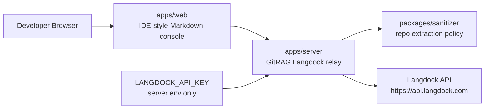

<p align="center">
  
</p>

<h1 align="center">GitRAG</h1>

<p align="center">
  Open-source repo oracle for developer teams, powered by Langdock enterprise RAG.
</p>

<p align="center">
  <strong>Ask a repository questions. Get grounded answers with citations. Keep credentials server-side.</strong>
</p>

---

## What GitRAG Is

GitRAG turns a local or remote source repository into a safe, queryable context layer for Langdock coding models. It crawls a repo, removes noisy or unsafe files, sends sanitized code context through a server-side Langdock relay, and renders answers in an IDE-style chat console.

The browser never receives your Langdock Workspace API key.

## Repository Layout

```text
git-rag/
├── apps/
│   ├── web/          # Next.js App Router, Tailwind, Radix-ready IDE console
│   └── server/       # Node.js/TypeScript Langdock relay API
├── packages/
│   ├── cli/          # Global gitrag binary exposed through package.json#bin
│   └── sanitizer/    # Repo crawling and code-cleaning primitives
├── scripts/
│   ├── install.sh    # macOS, Linux, WSL installer
│   └── install.ps1   # Native Windows PowerShell installer
├── package.json
└── pnpm-workspace.yaml
```

## One-Line Install

The installers verify `git`, Node.js `>=18`, clone the repository, install dependencies with pnpm, build packages, and globally link the `gitrag` CLI through npm's native cross-platform shim system.

### macOS

```bash
curl -fsSL https://raw.githubusercontent.com/janpaul80/gitrag/main/scripts/install.sh | bash
```

### Linux

```bash
curl -fsSL https://raw.githubusercontent.com/janpaul80/gitrag/main/scripts/install.sh | bash
```

### WSL

```bash
curl -fsSL https://raw.githubusercontent.com/janpaul80/gitrag/main/scripts/install.sh | bash
```

### Windows PowerShell

```powershell
iwr -UseBasicParsing https://raw.githubusercontent.com/janpaul80/gitrag/main/scripts/install.ps1 | iex
```

## Local Development

```bash
git clone https://github.com/janpaul80/gitrag.git
cd gitrag
pnpm install
pnpm build
```

Run the web app:

```bash
pnpm dev
```

Run the Langdock relay server:

```bash
pnpm dev:server
```

## Langdock Configuration

Create an environment file for the server:

```bash
cp apps/server/.env.example apps/server/.env
```

Set your Langdock Workspace API key:

```env
LANGDOCK_API_KEY=LDK_your_workspace_api_key_here
LANGDOCK_BASE_URL=https://api.langdock.com
GITRAG_SERVER_PORT=8787
```

The `LANGDOCK_API_KEY` must only live in server-side `.env` files or deployment secrets. Do not expose it through `NEXT_PUBLIC_*` variables.

## Safety Architecture



GitRAG keeps browser traffic credential-free. The web app sends chat and repository intent to the local or hosted GitRAG server. The server loads `LANGDOCK_API_KEY`, applies route-level validation, calls Langdock, and streams responses back to the UI.

## CLI Preview

```bash
gitrag --help
gitrag doctor
gitrag sanitize ./my-repo
```

The first release will ship source installation. The public package roadmap targets:

```bash
npm install -g @gitrag/cli
```

## Status

GitRAG is in initial scaffold. The monorepo, installer path, CLI boundary, server boundary, sanitizer package, and web application shell are established.
