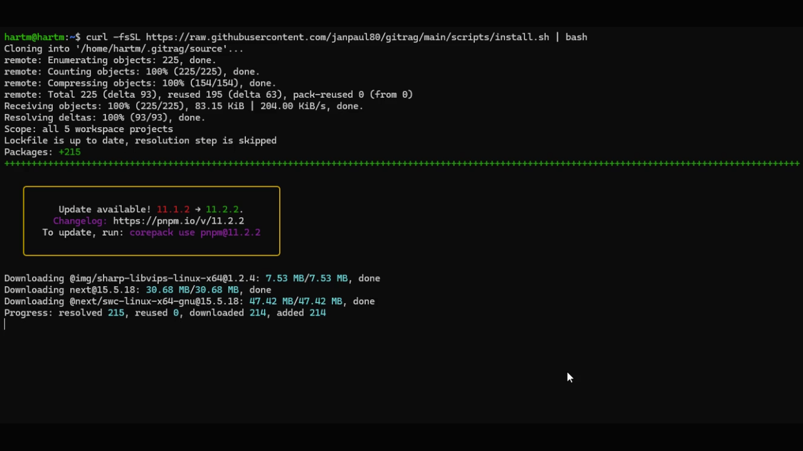
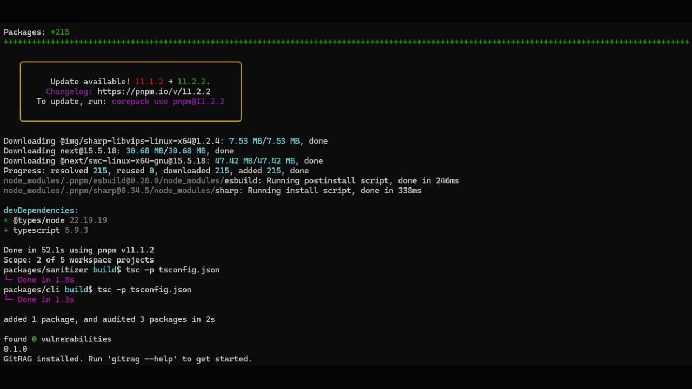
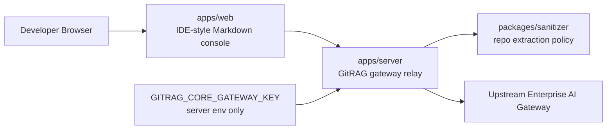

<p align="center">
  
</p>

<h1 align="center">GitRAG</h1>

<p align="center">
  Open-source repo oracle for developer teams, powered by a secure, compliance-ready Enterprise AI Gateway Integration.
</p>

<p align="center">
  <strong>Ask a repository questions. Get grounded answers with citations. Keep credentials server-side.</strong>
</p>

---

## Demo

<video src="apps/docs/public/media/gitrag-media01.mp4" controls poster="apps/docs/public/media/gitrag-install-01.png" width="100%">
  Watch the GitRAG installer demo.
</video>

| Installer progress | Successful install |
| --- | --- |
|  |  |

## What GitRAG Is

GitRAG turns a local or remote source repository into a safe, queryable context layer for Enterprise AI Gateway-backed coding models. It crawls a repo, removes noisy or unsafe files, sends sanitized code context through a server-side gateway relay, and renders answers in an IDE-style chat console.

The browser never receives your Enterprise AI Gateway key.

## Repository Layout

```text
git-rag/
├── apps/
│   ├── web/          # Next.js App Router, Tailwind, Radix-ready IDE console
│   └── server/       # Node.js/TypeScript Enterprise AI Gateway relay API
├── packages/
│   ├── cli/          # Global gitrag binary exposed through package.json#bin
│   └── sanitizer/    # Repo crawling and code-cleaning primitives
├── scripts/
│   ├── install.sh    # macOS, Linux, WSL installer
│   └── install.ps1   # Native Windows PowerShell installer
├── package.json
└── pnpm-workspace.yaml
```

## One-Line Install

The installers verify `git`, Node.js `>=18`, clone the repository, install dependencies with pnpm, build packages, and globally link the `gitrag` CLI through npm's native cross-platform shim system.

### macOS

```bash
curl -fsSL https://raw.githubusercontent.com/janpaul80/gitrag/main/scripts/install.sh | bash
```

### Linux

```bash
curl -fsSL https://raw.githubusercontent.com/janpaul80/gitrag/main/scripts/install.sh | bash
```

### WSL

```bash
curl -fsSL https://raw.githubusercontent.com/janpaul80/gitrag/main/scripts/install.sh | bash
```

### Windows PowerShell

```powershell
iwr -UseBasicParsing https://raw.githubusercontent.com/janpaul80/gitrag/main/scripts/install.ps1 | iex
```

## Local Development

```bash
git clone https://github.com/janpaul80/gitrag.git
cd gitrag
pnpm install
pnpm build
```

Run the web app:

```bash
pnpm dev
```

Run the gateway relay server:

```bash
pnpm dev:server
```

## Gateway Configuration

Create an environment file for the server:

```bash
cp apps/server/.env.example apps/server/.env
```

Set your Enterprise AI Gateway key:

```env
GITRAG_CORE_GATEWAY_KEY=your_gateway_key_here
GITRAG_CORE_GATEWAY_URL=https://gateway.example.com
GITRAG_SERVER_PORT=8787
```

The `GITRAG_CORE_GATEWAY_KEY` must only live in server-side `.env` files or deployment secrets. Do not expose it through `NEXT_PUBLIC_*` variables.

## Safety Architecture



GitRAG keeps browser traffic credential-free. The web app sends chat and repository intent to the local or hosted GitRAG server. The server loads `GITRAG_CORE_GATEWAY_KEY`, applies route-level validation, calls the upstream Enterprise AI Gateway, and streams responses back to the UI.

## CLI Preview

```bash
gitrag --help
gitrag doctor
gitrag sanitize ./my-repo
gitrag sync ./my-repo --collection collection_123
```

Doctor checks the local runtime before sync:

```text
✔ Node.js >= 18
✔ Local GitRAG Relay Server Online
✔ Gateway Environment Key Configured
```

Default sanitizer safety limits are 250 source files and 15MB of collective source content per sync. For large repositories, point GitRAG at a focused subfolder or tighten `.gitignore`.

The first release will ship source installation. The public package roadmap targets:

```bash
npm install -g @gitrag/cli
```

MIT License

## Status

GitRAG is in initial scaffold. The monorepo, installer path, CLI boundary, server boundary, sanitizer package, and web application shell are established.
